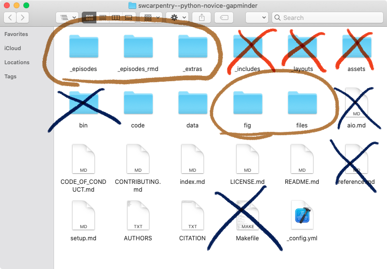

background-image: url(https://carpentries.org/assets/img/TheCarpentries.svg)
background-size: 75%
background-position: center

```{r setup, include=FALSE}
options(htmltools.dir.version = FALSE)
# comment
```


???

The Carpentries is a global organization of volunteers who teach
foundational data and coding skills to researchers worldwide. 

*ALT: The Carpentries Logo*

---

class: center,middle

.pull-left[
.large-brain[.c-blue[&emsp;**We...**]]  
.brain[
Act Openly     
Empower One Another    
.c-red[**Value All Contributions**]
]]

.pull-right[
.large-brain[.c-blue[&emsp;**We are...**]]    
.brain[
Always Learning    
.c-red[**Inclusive of All**]    
]]

.center[
.large-brain[.c-blue[&emsp;**We champion...**]]   
.brain[
.c-red[**People First**]    
Access for All    
Community Collaboration    
Strength Through Diversity
]]

???

What makes us stand out is not the fact that we use evidence-based practices in
teaching, it's that we align all of our decisions with our core values: we put
people first and we value all contributions.

---
class:center 
.large-brain[The **.c-blue[Lesson]**]

???

Our lessons are distributed as open-licensed websites built on a consistent
style that adheres to active learning principals. We use these lessons as the
source material for the hundreds of workshops we run each year. 

These sites have three distinct audiences.

---
class: center
.large-brain[1.&nbsp;The **.c-blue[ Instructor]**]


???

first: The certified Carpentries Instructors who refer to these materials as they teach our workshops.

---
class: center
.large-brain[2.&nbsp;The **.c-blue[Learner]**]

???
Next, there are the learners in a Carpentries workshop who rely on these lessons
after a workshop as they review and practice their newly aquired skills.

---
class: center
.large-brain[3.&nbsp;The **.c-blue[Educator]**]

???

Last, but not least, there are the educators like yourselves, who adapt these
open-licensed materials for their own lessons.

---
class: center
.large-brain[The **_.c-light-blue[Community]_**]

???

The source for these lessons are hosted on GitHub where volunteer Maintainers
ensure that the lessons are accurate and up-to-date. 

We encourage a culture of open contribution, where members of our community can
suggest improvements like a simple typo fix or a better explanation of an
important lesson concept.

We want **anyone** to be able to go to the repository and make a suggestion to
improve our lessons... 

at least that was our intention.

---
background-image: url(path-tweet.png)
background-size: contain
background-position: center
class:center

???

I want to pause for a second here and highlight this tweet that came across my
feed as I was preparing this talk.

It shows a fork between a paved path and an unpaved footpath across a patch of
grass, which leads to a crosswalk. There is a sign in front of the unpaved path
that says "Please use the purpose made path provided." The tweet author points
out that "the sign knows it has lost."

This unofficial footpath is called a "desire path". It is an
important concept in design because it shows the difference between what
the designers intended and how people actually use the space.

*ALT: Tweet by @SarahNicolas that says "This sign knows it has lost." With an
image of a sign in front of a dirt path that extends from a paved path. The sign
says 'Please use the purpose made path provided."*

source: <https://twitter.com/SarahNicholas/status/1401510907604353024?s=20>

---
class:center,middle


.galaxy-brain[**Desire paths?**

**In .c-light-blue[_our_] community?**]

???

As our community has grown, new desire paths were being created across our
lesson infrastructure landscape. No signs or, in our case, documentation would
stop contributors to our lessons from stepping outside these complex, purpose
made, paths in our lesson infrastructure. 

We needed to rethink our infrastructure altogether in a way that is more
inclusive and welcoming for everyone.

---
background-image: url(https://d33wubrfki0l68.cloudfront.net/aee91187a9c6811a802ddc524c3271302893a149/a7003/images/bandthree2.png)
background-size: contain
background-position: top
class: bottom

.grey[Image Credit: Xie, Allaire, and Grolemund.    
["R Markdown The Definitve Guide"](https://bookdown.org/yihui/rmarkdown/)    
CRC Press 2019]
???

We found that the R publishing ecosystem is flexible enough to give
us the tools we need **to reduce barriers for publishing lessons and
further our mission**. 

I will introduce you to our current infrastructure, its unique challenges, our
solutions, and how we used past and present feedback from our community to
iteratively refine our design.

Before continuing, I want to remind everyone of two things. First:


*ALT: Cover of the R Markdown The Definitive Guide, which is a large letter "R"
surrounded by output document logos like LaTeX, epub, HTML5, PDF, Word, etc.*

---
class: center,middle

.galaxy-brain[
**There is no .c-light-blue[_right or wrong_]    
  only .c-light-blue[_better or worse_]**
]

.left[
.large-brain[
*&mdash;Greg Wilson*    
&ensp; .grey[*(Founder of Software Carpentry)*]
]
.smol-brain[
[*source: "Templates: We Live, We Learn"*](https://software-carpentry.org/blog/2014/12/templates-we-live-we-learn.html)
]
]
???

There is no right or wrong, only better or worse.

Greg Wilson---the founder of Software Carpentry---wrote this after several
iterations of the lesson infrastructure. I am putting it here as a reminder that
the infrastructure we have now was working for us at the time. What we come up
with will have its own difficulties down the road, but what is important is that
we build something that better addresses the needs of our community, which leads
me to my second reminder:

---
background-image: url(you-belong.jpg)
background-size: contain
background-repeat: no-repeat
background-position: center

???

You belong in The Carpentries.

As the community has grown, our infrastructure has been put to the test and we
have continuously updated our workflows to make it easier for people to contribute.
The reason we do this is because we are driven by our values. 

In The Carpentries, you belong, no matter if you have been working as a systems
administrator for a university HPC cluster or if you have just learned to write
your first R script.

To better understand the decisions we are making, let's start by reviewing
our current infrastructure.

*ALT: hexagonal logos of Library Carpentry, Data Carpentry, and Software
Carpentries joined raidially and circumscribed in an orange circle. Below the
circle is a message that says "You Belong in The Carpentries"*

---
background-image: url(lesson-box-1.png)
background-size: 110%
background-repeat: no-repeat
background-position: right 70% top -55%
class: center, bottom

.pull-left[
# .galaxy-brain[Markdown&emsp;&emsp;&emsp;]
]
.pull-right[
# .galaxy-brain[&emsp;Website]
]

???
Our lessons are written in markdown and transformed into a website via GitHub
Pages and the Jekyll static site generator.

The idea behind this choice was that it was the most straightforward way to
create a static website without needing a server like Wordpress or Drupal sites.
Ideally, it also provided a way for people to use this as an example of how they
could build their own website.

The paradigm of being able to write markdown lessons and get a functional website
out of it is not a new concept. In fact, there are over 460 iterations of
this concept (according to https://staticsitegenerators.net). Jekyll happens to
be the one that GitHub implemented early on to provide documentation for the
open-source project it hosted, and thus, it stuck.

*ALT: A image showing a markdown page with an arrow pointing to an HTML website.*

---
background-image: url(lesson-box-2.png)
background-size: contain
background-repeat: no-repeat
background-position: center


???

We created an all-in-one bundle for lessons that provided styling templates in
HTML, CSS, and JavaScript along with validation scripts in Python, and R scripts
to build RMarkdown-based lessons. All of this was orchestrated by a Makefile.
The purpose of this approach was two-fold:

1. To maintain a consistent style that emphasized our principles of
   evidence-based teaching such as learning objectives and formative assessment;
2. To demonstrate how the skills we teach in our workshops could be applied
   to real-life situations.

*ALT: A image showing a markdown page with an arrow pointing to an HTML website.
Below these is a brown box labelled "Lesson" with four items inside representing
the markdown document, the tools to build the lesson, the validator, and the
HTML template.* 

---
background-image: url(expect-delays.jpg)
background-size: cover
background-repeat: no-repeat
background-position: center
class: bottom, right

photo credit: Erik McLean     
https://unsplash.com/photos/7lyRKyKIdJY

???

While this was conceptually good in theory, this infrastructure design has three
significant drawbacks for contributors:

*ALT: Orange electric road sign at night that says "EXPECT DELAYS"*

---
class: center, middle
[](https://twitter.com/gvwilson/status/1380115181708189701?s=20)

???

The first is installation pains.

Having Jekyll, Python, and Make as dependencies means that people who want to
build these lessons on their machines need all three of these successfully
installed and up-to-date. This is especially frustrating for Windows users who
have none of these by default.
   
---
background-image: url(lesson-updates-1.png)
background-size: contain
background-repeat: no-repeat
background-position: center
class: center, middle

???

Secondly, with this design, all the scripts live _inside_ the repository.

*ALT: Two boxes on a white field, both labelled lesson with the word "LESSON",
but the box above has a sign that says "TEMPLATE" written over the word "LESSON"
Both boxes have three round discs representing the tools, validator, and 
styling. The bottom box has three markdown documents in addition.*

---
background-image: url(lesson-updates-2.png)
background-size: contain
background-repeat: no-repeat
background-position: center
class: center, middle


???

This leads to the unfortunate pattern where lessons quickly become out of date
as they diverge from the improvements made upstream.
   
*ALT: Four boxes on a white field, all labelled with the word "LESSON",
but the two boxes on top have signs that say "TEMPLATE" written over the word
"LESSON". There is an arrow in the middle running from left to right representing
time. All boxes have three round discs representing the tools, validator, and 
styling. The components in the box on the top right have different hues than the
box on the bottom.*

---
class: center, middle



???

Another drawback is that we have a lesson website wrapped around a static site
generator (which in and of itself is a kind of desire path), this meant that it
was easy to contribute _if you were familiar with how Jekyll operated._ 

There is often a moment of panic in a new contributor's eyes when you show them
what the a lesson repository looks like. If you were not familiar with Jekyll,
then it was unclear where to even start if you were looking at the git
repository because there were no clear sign that marked the trail head. This
lead several lessons to find their own paths that ended up built in different
ways.

Over the last few years, we have begun finding these desire paths all across our
lesson infrastructure. These manifested through our communication channels and
frustration from contributors and maintainers alike. 

The thing about desire paths, though, is that they are not only challenges, but
also opportunities.

*ALT: screencapture displaying the contents of a file folder representing the
swcarpentry/python-novice-gapminder repository. It contains 11 folders and 12
files. There are annotations to this image: five of these folders are circled,
while four folders and two three files are crossed out to inidcate entry points
and danger zones, respectively.*

---
background-image: url(chopportunity-kitty.jpg)
background-size: cover
background-repeat: no-repeat
background-position: center
class: bottom, right

.credit[.galaxy-brain[.c-red[**Chopportunities**]]]

photo credit: Tran Mau Tri Tam    
<https://unsplash.com/photos/-81lVsfM4gQ>

???

At The Carpentries, we like to call these "chopportunities."

*ALT: picture of a kitten sitting up on a couch with one paw on the back cushion
and one paw on a pillow. It looks worried/scared*

---
background-image: url(lesson-growth.png)
background-size: contain
background-position: bottom

???


The growth that we have experienced in the past few years is a chopportunity.
We have seen not only a growth in the number of community members, but also,
in the number community contributed lessons since we started
The Carpentries Incubator.

Our challenge is clear: the all-in-one lesson infrastructure does not scale
well to the growing number of lessons.


*ALT: stacked area showing the growth in the number of lessons from 2015 to
present day. There is an arrow pointing to the top of the data that says "139
lessons". The data are stratified by our four programs: Software Carpentry on
bottom, followed by Data Carpentry, Library Carpentry, and Incubator. The
incubator comprises of more than one half of all lessons in the current day.*

---


???

Our opportunity here is to re-imagine the infrastructure in a way that truly
values all contributions: this includes the spectrum from everyday educators
who want to share their knowledge, to the tinkerers who want access panels to
understand what is going on behind the scenes.

---
background-image: linear-gradient(to bottom, rgba(255, 255, 255, 0.90) 75%, rgba(227, 227, 227, 0.75) 85%), url(https://raw.githubusercontent.com/zkamvar/stunning-barnacle/27cdbe8d900cea8536c4a5f6ed798860c3867878/img/broad-flow.dot.svg)
background-size: contain, contain
background-repeat: no-repeat, no-repeat
background-position: center
class: middle

.brain[<https://carpentries.github.io/sandpaper-docs>

<https://carpentries.org/blog/2020/08/lesson-template-design/>

<https://carpentries.org/blog/2021/07/infrastructure-testing/>]

???


The solution we came up with uses R and while I simply do not have enough time
to discuss all the features, you can find out for yourself if you visit our blog
posts and documentation on how to get started.

So, how and why did we choose R to create the next iteration of our lesson
infrastructure?

---
background-image: url(infrastructure-concept.png)
background-size: contain
background-repeat: no-repeat
background-position: center


???

We wanted a general solution where you could take markdown or RMarkdown files,
place them in a folder and generate a Carpentries-style lesson without having
complicated paths or generated files lying around. The first thing we did was
to investigate the existing landscape.

It was important that we choose something that is user friendly, easy to
install, easily customizable, and has a welcoming community behind it. We tried
out several static site generators, but the largest barrier for many of these
was that they were not easy to install and maintain.

*ALT: A box labeled "LESSON" on a field of poorly-drawn grass with five markdown
documents inside of it. There are three discs representing rendering tools, 
validation, and sytling elements hovering in the clouds above.*

---
background-image: url(jomo.jpeg)
background-size: 45%
background-repeat: no-repeat
background-position: right

## Why R?

.brain[
1. fRiendly Communities!
   - R Ladies
   - rOpenSci
   - R Forwards
2. Easy To Install
3. Robust ecosystem
  - {knitr}
  - {RMarkdown}
  - _pandoc_
]

???

We settled on the fact that R is the best place to go for our needs
because:

1. First and foremost: R is chock-full of friendly communities!
  - RLadies
  - ROpenSci
  - RForwards
  - MiR
2. R is easy to install on all major operating systems and
   is available online via RStudio Cloud
3. R has a robust ecosystem for publishing thanks to {knitr} and RMarkdown

*ALT: picture of my russian blue cat, Jomo, stting on a chair and looking up,
directly into the camera.*

---
background-image: url(https://bookdown.org/yihui/blogdown/images/logo.png), url(https://bookdown.org/yihui/bookdown/images/logo.png), url(https://hugodown.r-lib.org/reference/figures/logo.png), url(unique-brush.jpg)
background-size: 15%, 15%, 15%, cover 
background-repeat: no-repeat
background-position: 78.85% 68.35%, 70% 35%, 87.75% 35%, center
class: center, bottom 

.galaxy-brain[
.c-blue[
**Prior Art**
]]

???

Once we identified R as our solution, the natural place to go was one of the
RMarkdown variants like {blogdown} or {hugodown}, but we found that while the
tools were indeed separated from the content and the documentation was rich and
accessible, there were many aspects that would not fit our needs, in particular
the presence of styling inside the repository, meaning that the user was 
ultimately responsible for maintaining the visual presence.

*ALT: background picture of a close-up paint brush on a colorful abstract
watercolor with the blogdown hex in the foreground to the right.*

---
background-image:  url(https://raw.githubusercontent.com/r-lib/pkgdown/master/man/figures/logo.png), url(https://raw.githubusercontent.com/r-lib/pkgdown/master/man/figures/logo.png), url(pkgdown-datasaurus.png), url(pkgdown-nmf.png), url(pkgdown-bayesplot.png), url(pkgdown-tinkr.png)
background-size: 32%
background-repeat: no-repeat
background-position: 96% 0%, 98% 100%, 2% 5%, 55% 5%, 2% 95%, 55% 95%
class: middle

.galaxy-brain[**Distributed Style**]

???

We realized that an unlikely contender, {pkgdown}, a documentation site
generator, used the same model that we were looking for: It meets people where
they are, content is pure markdown with no extra templating required, the tools
to build everything lived in a separate package, and you can customize its
appearance by making your own package to supply your CSS, JavaScript, and HTML
templates, which has been done many times for individual and organization-wide
documentation. 

*ALT: a background collage of screencaptures for four pkgdown sites with two
stacked pkgdown boxes to the right.*

---
class: center


???

From this model, we were able to pave over the desire paths in our
infrastructure by creating three R packages: 

 - {sandpaper} is the engine that orchestrates building and maintaining lessons
 - {varnish} is the styling that hosts the CSS, JavaScript, and HTML templates
 - {pegboard} serves as a validator (and converter!) for lesson content

---
class: center, top


???

Of course, the first thing any contributor will see is the folder structure and
it will help if this resembles the structure of the lesson website.

---
class: center, top


???

So our lessons consist of folders that correspond to the website dropdown menus:
one folder for lesson chapters, one for extra information for learners, one for
extra information for instructors, and one to contain learner profiles.

---
class: center, top


???

The final folder is one of the access panels that contains the rendered markdown
files---so you can use them in another context---and static website---so that you
can put it on a USB stick to share it without additional software (like Hugo or Jekyll).

Our solution ticks all the boxes that satisfy our design choices,
but if we ended up designing something that R enthusiasts
love, but is unusable by newcomers, Python, or Matlab folks, then we are not
in line with our value of being inclusive of all.

---
background-image: url(https://carpentries.org/images/groupshot.jpg)
background-size: cover
background-repeat: no-repeat
background-position: center
class: bottom

.credit[**photo credit: Bérénice Batut**]


???

Our goal is for authors to focus on the content over the tooling.
We want lesson authors to create a lesson directly from the source
they already work with: markdown/RMarkdown/MyST notebooks.
To do this, we needed to test the minimal
viable product on actual maintainers and we needed to make sure that they were
spread across the spectrum of familiarity with:

 - using R,
 - the current infrastructure,
 - the way The Carpentries operates.
 
*ALT: Carpentries group shot of > 50 people modelling the carpentries logo
by raising their arms and tilting 45 degrees to the left.*

---
background-image: url(user-testing.jpg)
background-size: 70%
background-repeat: no-repeat
background-position: right, top
class: middle

.galaxy-brain[**ALPHA TESTING**]

- Angelique Trusler
- Christina Koch
- David Pérez-Suárez
- Drake Asberry
- Eric Jankowski
- Erin Becker
- Ezra Herman
- Fan Du
- François Michonneau
- Jon Haitz Legarreta Gorroño
- Karen Word
- Kari Jordan
- Maneesha Sane
- Michael Culshaw-Maurer
- Sarah Brown
- Sarah Stevens
- Shaun C. Gaynor
- Toby Hodges
- anonymous

.right[
photo credit: David Travis    
<https://unsplash.com/photos/WC6MJ0kRzGw>
]

???

We recruited a total of 19 volunteers to run through Alpha Testing, which tested
the participants ability to install the required software and packages, create,
modify, and contribute to lessons. After the tests, I asked for 20-minute
open-ended interviews from the volunteers about their experience to identify
common stumbling blocks, challenges, and bright points. 

I want to take a moment to thank everyone who has participated, some of whom are
part of The Carpentries core team. I don't have the time to go into detail about
the results, but a big takeaway from this was that everyone was able to install
the infrastructure and any problems that occurred were from Git/GitHub, which is
a big improvement over the current system.

*ALT: A hand holding a pink sticky note that says "run a usability test" in front
of other sticky notes.*

---
background-image: url(community.jpg)
background-size: 50%
background-repeat: no-repeat
background-position: right
class: middle

.galaxy-brain[**Next Steps**]

.large-brain[.pull-left[
- Fix Bugs
- Improve Documentation
- Beta Test for Wider Audience
]]

???

We have just finished with this first testing phase and the next step for us is
to address the questions and concerns that were brought up (for example: how do
I use this without clobbering the current R installation on my system?), improve
the documentation, and get ready for the beta release, where we will try it on a
few live lessons to identify painpoints for the community. It is a slow process,
but this way we can avoid major unforseen issues (minor issues are a given),
bring users in on the ground floor, get valuable feedback, and strengthen trust
with our community.

*ALT: several hands in line on a log in the forest.*
---
class: center, middle

.large-brain[**if you want to go fast, go alone**]    

.galaxy-brain[**if you want to .c-light-blue[GO FAR],    
.c-light-blue[GO TOGETHER]**]

???

And I want to conclude by saying that we ended up choosing a solution that we
believe aligns with our values and will work with our community. We do not have
all the answers right now, but we go through this process because we want to
make sure we put people first and are always learning.

---
background-image: url(https://bit.ly/3iOWCbl), url(https://bit.ly/3gHRtyZ), url(https://bit.ly/3vtZY6k), url(https://bit.ly/35zweKN) 
background-size: 50%, 35%, 45%, 35%
background-position: left 10%, 90% 10%, 10% 80%, 90% 80%

???

None of this would have been possible without generous grants from
the Alfred P. Sloan Foundation, the Moore Foundation, the Chan-Zuckerberg Initiative, and the R Consortium Infrastructure Steering Committee.

*ALT: logos of the Chan Zuckerberg Initiative, Alfred P. Sloan Foundation, 
R Consortium, and Gordon and Betty Moore Foundation, respectively.*

---
background-image: url(jomo.jpeg)
background-size: 45%
background-repeat: no-repeat
background-position: right
class: middle

.pull-left[
.galaxy-brain[Thank You!]

.brain[

Thank you to our .c-light-blue[Alpha Testers] and .c-light-blue[Carpentries Community]    

Additional thanks:   
.c-blue[Maëlle Salmon&mdash;Allison Hill&mdash;Christophe Dervieux&mdash;Daniel Chen&mdash;Angela Li&mdash;Greg Wilson&mdash;Dhavide Aruliah&mdash;Nischal Shrestha&mdash;Scott Chamberlain
]]]

???

And finally, thank you to all of our alpha testers, the carpentries community,
and all the folks who have taken the time to sit down and talk with me about
early drafts of the new infrastructure.

And thank you for listening.

*ALT: picture of my russian blue cat, Jomo, stting on a chair and looking up,
directly into the camera.*

<!--
Note: the useR template modifies the css for the background image, so we need to adjust the size and position manually for every slide.
-->

